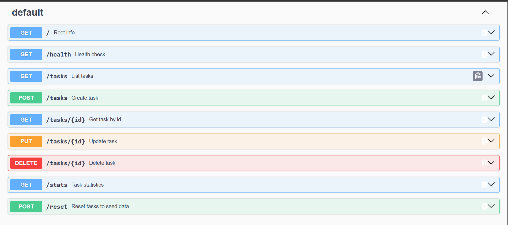

# Task API

In-memory Task API built with Node.js + Express. Provides CRUD operations for tasks with fields `id` (number), `title` (string), `done` (boolean). Pre-seeded with 3 example tasks.

## Install & Run

```bash
npm install
node server.js
```

Or in one line:

```bash
npm install && node server.js
```

Server runs at `http://localhost:3000`.

## Endpoints

| Method | Path | Description |
|--------|------|-------------|
| GET | `/` | Returns API name, version and list of endpoints |
| GET | `/health` | Health check |
| GET | `/tasks` | List all tasks (supports `done`, `search`, `limit`, `offset` query params) |
| GET | `/tasks/:id` | Get single task by id |
| POST | `/tasks` | Create task with `{ "title": string }` |
| PUT | `/tasks/:id` | Update task with `{ "title"?, "done"? }` |
| DELETE | `/tasks/:id` | Delete task |
| GET | `/stats` | Returns `{ total, done, open }` counts |
| POST | `/reset` | Reset tasks to 3 default seed tasks |
| GET | `/docs` | Swagger UI |

## Example

```bash
curl -i http://localhost:3000/health
```

Output:

```
HTTP/1.1 200 OK
X-Powered-By: Express
Content-Type: application/json; charset=utf-8
Content-Length: 15
ETag: W/"f-VaSQ4oDUiZblZNAEkkN+sX+q3Sg"
Date: Wed, 16 Sep 2026 10:00:00 GMT
Connection: keep-alive
Keep-Alive: timeout=5

{"status":"ok"}
```

Another example:

```bash
curl -i http://localhost:3000/tasks
```

```
HTTP/1.1 200 OK
X-Powered-By: Express
Content-Type: application/json; charset=utf-8
Content-Length: 141
ETag: W/"8d-..."
Date: Wed, 16 Sep 2026 10:00:00 GMT
Connection: keep-alive

[{"id":1,"title":"Buy groceries","done":false},{"id":2,"title":"Walk the dog","done":true},{"id":3,"title":"Write code","done":false}]
```


